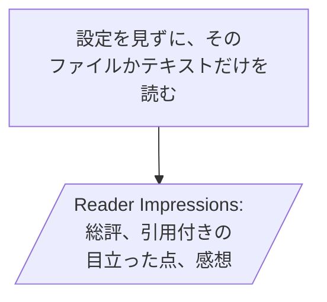

# read

ファイル1つまたは貼り付けたテキストを初めての読者として読み、率直な感想を返す。

平行四辺形はユーザーに見えて、答えるもの。

```mermaid
flowchart TD
  read[設定を見ずに、その<br/>ファイルかテキストだけを読む]
  read --> out[/"Reader Impressions:<br/>総評、引用付きの<br/>目立った点、感想"/]
```
