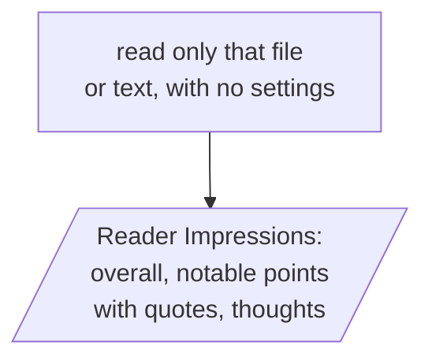

# read

Reads one file or pasted text as a first-time reader and gives honest impressions.

Parallelograms are what the user sees and answers.

```mermaid
flowchart TD
  read[read only that file<br/>or text, with no settings]
  read --> out[/"Reader Impressions:<br/>overall, notable points<br/>with quotes, thoughts"/]
```
