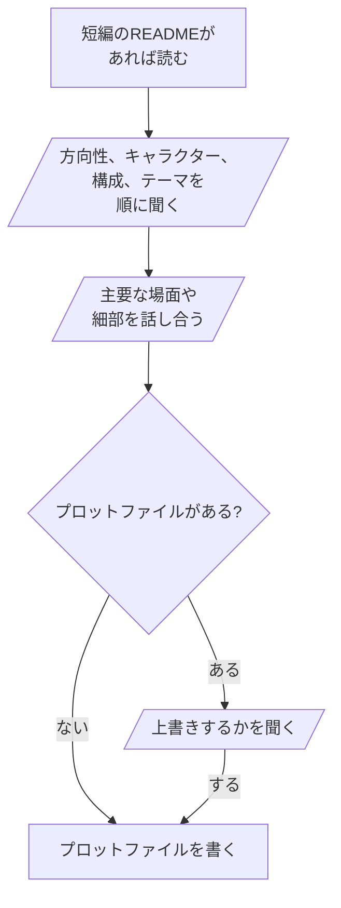

# shorts-plot

short-id を受け取り、src/shorts/ 配下の短編のプロットをユーザーと一緒に作る。

平行四辺形はユーザーに見えて、答えるもの。

```mermaid
flowchart TD
  read[短編のREADMEが<br/>あれば読む]
  read --> q[/"方向性、キャラクター、<br/>構成、テーマを<br/>順に聞く"/]
  q --> talk[/"主要な場面や<br/>細部を話し合う"/]
  talk --> exists{プロットファイルがある?}
  exists -- "ある" --> ow[/上書きするかを聞く/]
  exists -- "ない" --> write
  ow -- "する" --> write[プロットファイルを書く]
```
