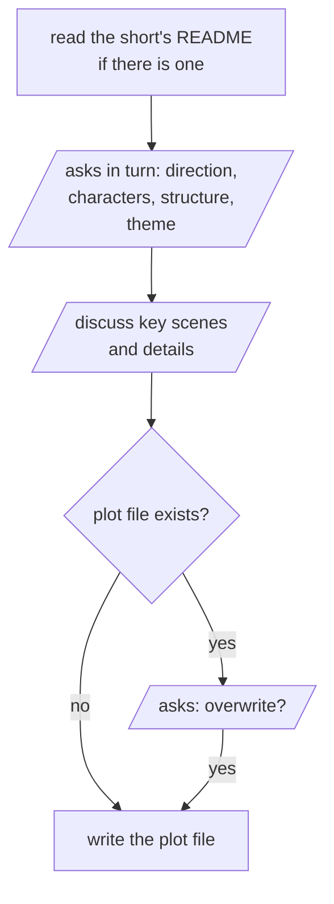

# shorts-plot

```mermaid
flowchart TD
  read[read the short's README<br/>if there is one]
  read --> q[/"asks in turn: direction,<br/>characters, structure,<br/>theme"/]
  q --> talk[/"discuss key scenes<br/>and details"/]
  talk --> exists{plot file exists?}
  exists -- "yes" --> ow[/"asks: overwrite?"/]
  exists -- "no" --> write
  ow -- "yes" --> write[write the plot file]
```
