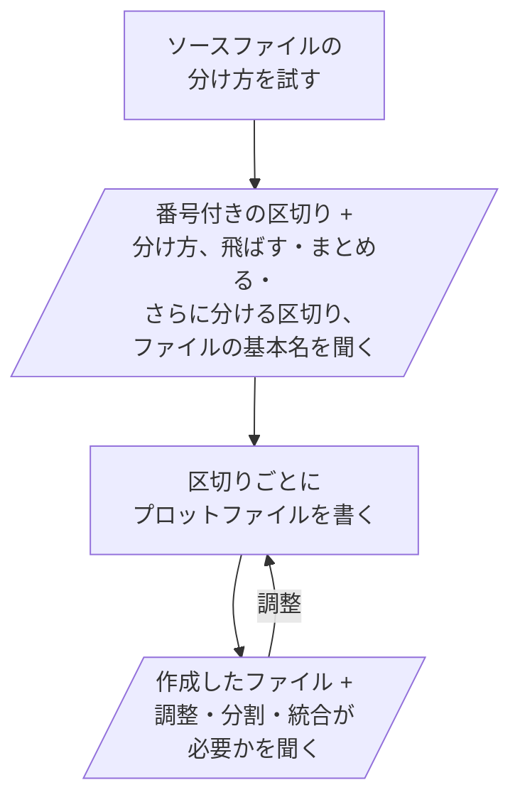

# split-plot

1つのソースファイルを、シーンやセクションごとのプロット骨子ファイルに分割する。

平行四辺形はユーザーに見えて、答えるもの。

```mermaid
flowchart TD
  split[ソースファイルの<br/>分け方を試す]
  split --> show[/"番号付きの区切り +<br/>分け方、飛ばす・まとめる・<br/>さらに分ける区切り、<br/>ファイルの基本名を聞く"/]
  show --> write[区切りごとに<br/>プロットファイルを書く]
  write --> ask[/"作成したファイル +<br/>調整・分割・統合が<br/>必要かを聞く"/]
  ask -- "調整" --> write
```
