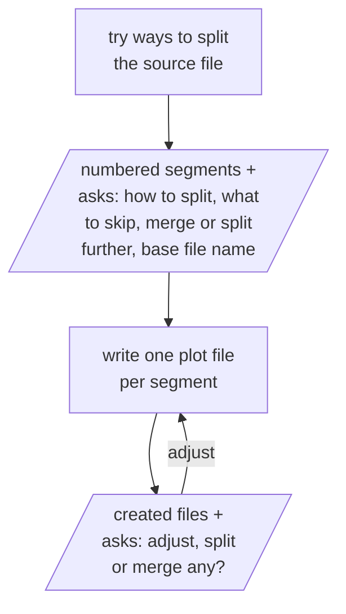

# split-plot

```mermaid
flowchart TD
  split[try ways to split<br/>the source file]
  split --> show[/"numbered segments +<br/>asks: how to split, what<br/>to skip, merge or split<br/>further, base file name"/]
  show --> write[write one plot file<br/>per segment]
  write --> ask[/"created files +<br/>asks: adjust, split<br/>or merge any?"/]
  ask -- "adjust" --> write
```
