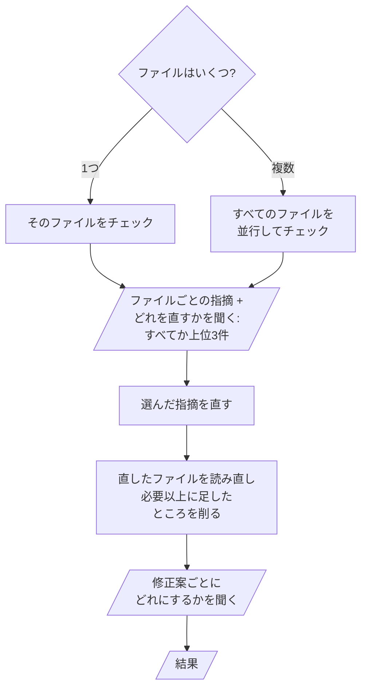

# staging-all

ディレクトリ内のすべての .txt ファイルに、シーンの描写チェックをまとめてかける。

平行四辺形はユーザーに見えて、答えるもの。

```mermaid
flowchart TD
  files{ファイルはいくつ?}
  files -- "1つ" --> one[そのファイルをチェック]
  files -- "複数" --> many[すべてのファイルを<br/>並行してチェック]
  one --> ask
  many --> ask[/"ファイルごとの指摘 +<br/>どれを直すかを聞く:<br/>すべてか上位3件"/]
  ask --> fix[選んだ指摘を直す]
  fix --> trim[直したファイルを読み直し<br/>必要以上に足した<br/>ところを削る]
  trim --> opts[/修正案ごとに<br/>どれにするかを聞く/]
  opts --> done[/結果/]
```
