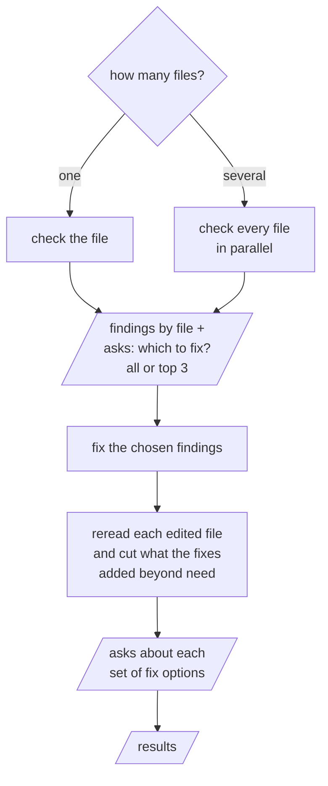

# staging-all

Runs the scene description check on every .txt file in a directory at once.

Parallelograms are what the user sees and answers.

```mermaid
flowchart TD
  files{how many files?}
  files -- "one" --> one[check the file]
  files -- "several" --> many[check every file<br/>in parallel]
  one --> ask
  many --> ask[/"findings by file +<br/>asks: which to fix?<br/>all or top 3"/]
  ask --> fix[fix the chosen findings]
  fix --> trim[reread each edited file<br/>and cut what the fixes<br/>added beyond need]
  trim --> opts[/asks about each<br/>set of fix options/]
  opts --> done[/results/]
```
