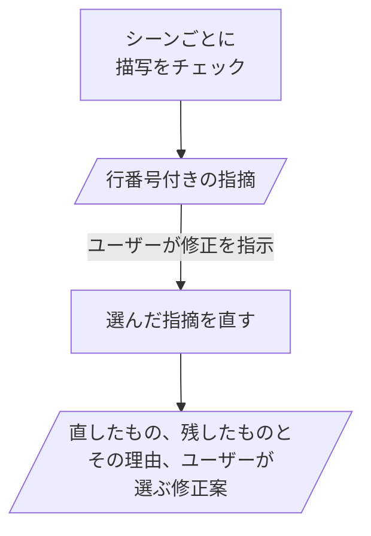

# staging

1つの本文ファイルを、シーンごとに描写の質の点からチェックする。

平行四辺形はユーザーに見えて、答えるもの。

```mermaid
flowchart TD
  check[シーンごとに<br/>描写をチェック]
  check --> report[/行番号付きの指摘/]
  report -- "ユーザーが修正を指示" --> fix[選んだ指摘を直す]
  fix --> done[/"直したもの、残したものと<br/>その理由、ユーザーが<br/>選ぶ修正案"/]
```
