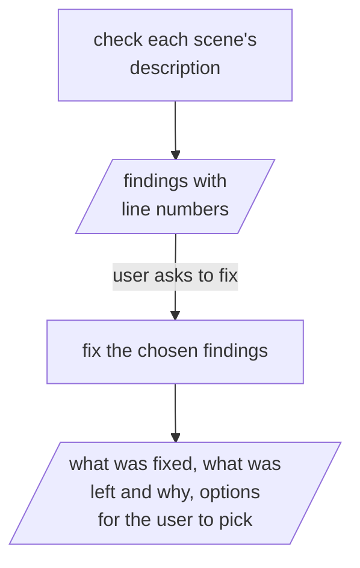

# staging

Checks one story file scene by scene for description quality.

Parallelograms are what the user sees and answers.

```mermaid
flowchart TD
  check[check each scene's<br/>description]
  check --> report[/findings with<br/>line numbers/]
  report -- "user asks to fix" --> fix[fix the chosen findings]
  fix --> done[/"what was fixed, what was<br/>left and why, options<br/>for the user to pick"/]
```
