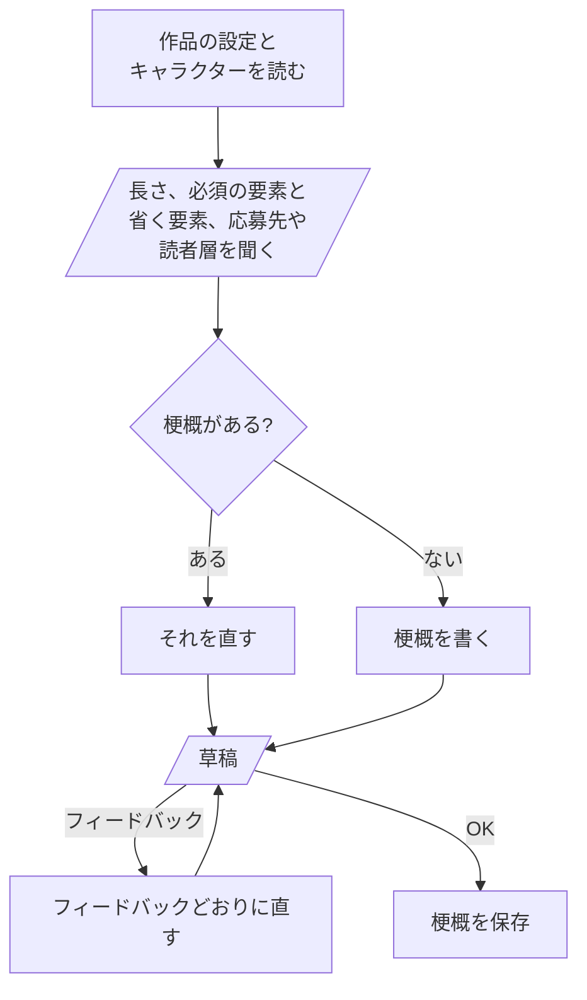

# synopsis

作品の梗概を書く。または既存の梗概を直す。

平行四辺形はユーザーに見えて、答えるもの。

```mermaid
flowchart TD
  read[作品の設定と<br/>キャラクターを読む]
  read --> q[/"長さ、必須の要素と<br/>省く要素、応募先や<br/>読者層を聞く"/]
  q --> exists{梗概がある?}
  exists -- "ある" --> revise[それを直す]
  exists -- "ない" --> draft[梗概を書く]
  revise --> show
  draft --> show[/草稿/]
  show -- "フィードバック" --> fix[フィードバックどおりに直す]
  fix --> show
  show -- "OK" --> save[梗概を保存]
```
