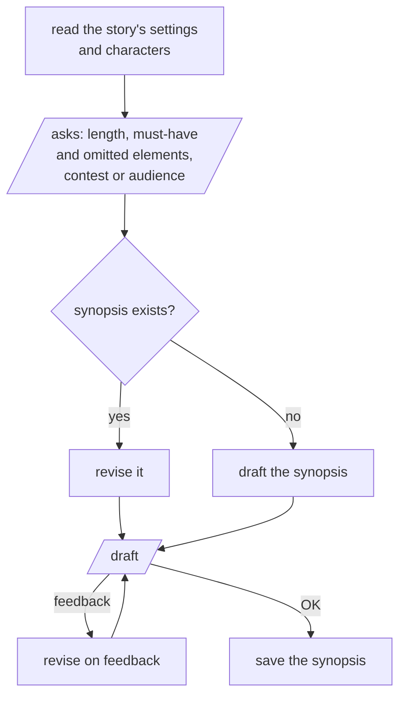

# synopsis

```mermaid
flowchart TD
  read[read the story's settings<br/>and characters]
  read --> q[/"asks: length, must-have<br/>and omitted elements,<br/>contest or audience"/]
  q --> exists{synopsis exists?}
  exists -- "yes" --> revise[revise it]
  exists -- "no" --> draft[draft the synopsis]
  revise --> show
  draft --> show[/draft/]
  show -- "feedback" --> fix[revise on feedback]
  fix --> show
  show -- "OK" --> save[save the synopsis]
```
