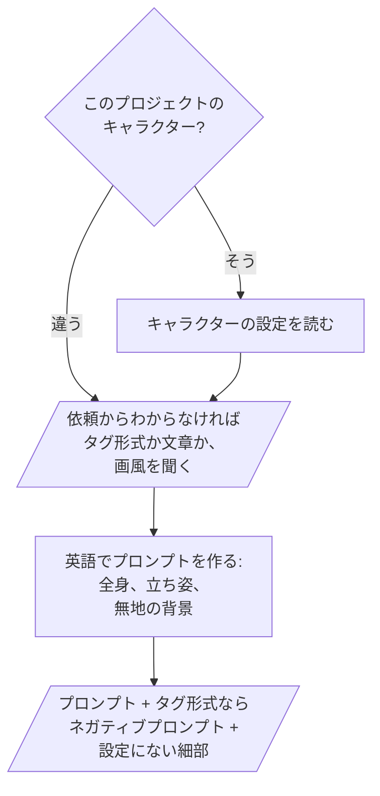

# tachie

キャラクターの立ち絵を描くための画像生成プロンプトを作る。

平行四辺形はユーザーに見えて、答えるもの。

```mermaid
flowchart TD
  who{このプロジェクトの<br/>キャラクター?}
  who -- "そう" --> read[キャラクターの設定を読む]
  who -- "違う" --> ask
  read --> ask[/"依頼からわからなければ<br/>タグ形式か文章か、<br/>画風を聞く"/]
  ask --> build["英語でプロンプトを作る:<br/>全身、立ち姿、<br/>無地の背景"]
  build --> out[/"プロンプト + タグ形式なら<br/>ネガティブプロンプト +<br/>設定にない細部"/]
```
