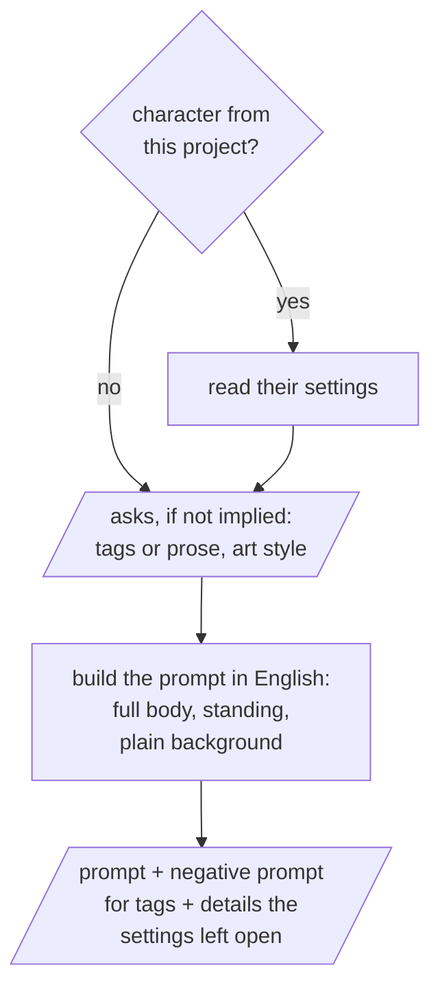

# tachie

Builds an image-generation prompt for a character's standing art (立ち絵).

Parallelograms are what the user sees and answers.

```mermaid
flowchart TD
  who{character from<br/>this project?}
  who -- "yes" --> read[read their settings]
  who -- "no" --> ask
  read --> ask[/"asks, if not implied:<br/>tags or prose, art style"/]
  ask --> build["build the prompt in English:<br/>full body, standing,<br/>plain background"]
  build --> out[/"prompt + negative prompt<br/>for tags + details the<br/>settings left open"/]
```
