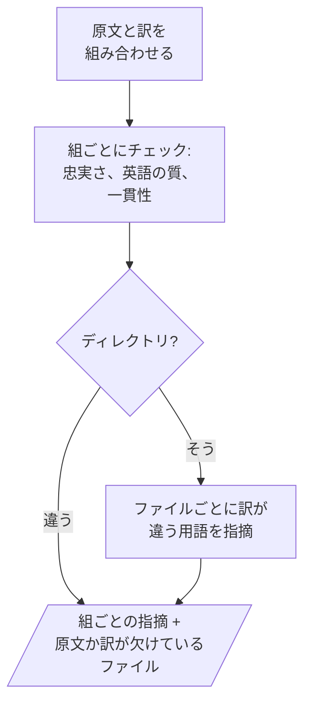

# translate-check

```mermaid
flowchart TD
  pairs[原文と訳を<br/>組み合わせる]
  pairs --> check["組ごとにチェック:<br/>忠実さ、英語の質、<br/>一貫性"]
  check --> dir{ディレクトリ?}
  dir -- "そう" --> cross[ファイルごとに訳が<br/>違う用語を指摘]
  dir -- "違う" --> report
  cross --> report[/"組ごとの指摘 +<br/>原文か訳が欠けている<br/>ファイル"/]
```
