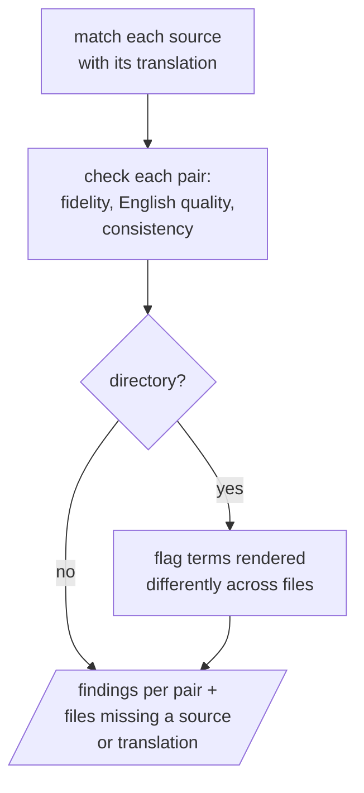

# translate-check

Checks an English translation against its Japanese source in both directions, for a file or a directory.

Parallelograms are what the user sees and answers.

```mermaid
flowchart TD
  pairs[match each source<br/>with its translation]
  pairs --> check["check each pair:<br/>fidelity, English quality,<br/>consistency"]
  check --> dir{directory?}
  dir -- "yes" --> cross[flag terms rendered<br/>differently across files]
  dir -- "no" --> report
  cross --> report[/"findings per pair +<br/>files missing a source<br/>or translation"/]
```
