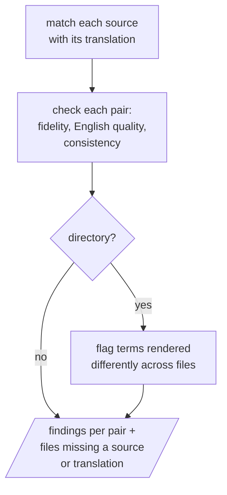

# translate-check

```mermaid
flowchart TD
  pairs[match each source<br/>with its translation]
  pairs --> check["check each pair:<br/>fidelity, English quality,<br/>consistency"]
  check --> dir{directory?}
  dir -- "yes" --> cross[flag terms rendered<br/>differently across files]
  dir -- "no" --> report
  cross --> report[/"findings per pair +<br/>files missing a source<br/>or translation"/]
```
