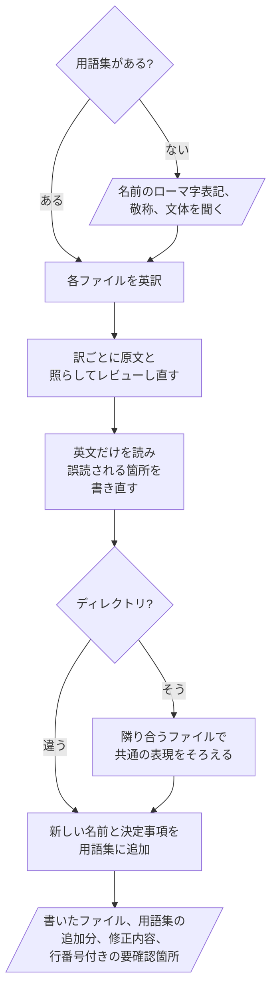

# translate

日本語の原稿ファイル、またはディレクトリ内のすべてのファイルを英訳する。

平行四辺形はユーザーに見えて、答えるもの。

```mermaid
flowchart TD
  gloss{用語集がある?}
  gloss -- "ない" --> ask[/"名前のローマ字表記、<br/>敬称、文体を聞く"/]
  gloss -- "ある" --> tr
  ask --> tr[各ファイルを英訳]
  tr --> review[訳ごとに原文と<br/>照らしてレビューし直す]
  review --> reader[英文だけを読み<br/>誤読される箇所を<br/>書き直す]
  reader --> dir{ディレクトリ?}
  dir -- "そう" --> align[隣り合うファイルで<br/>共通の表現をそろえる]
  dir -- "違う" --> gl
  align --> gl[新しい名前と決定事項を<br/>用語集に追加]
  gl --> report[/"書いたファイル、用語集の<br/>追加分、修正内容、<br/>行番号付きの要確認箇所"/]
```
