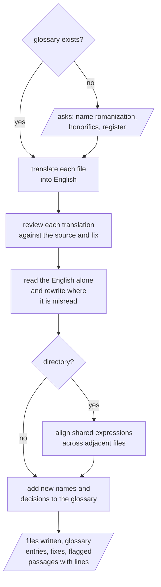

# translate

Translates a Japanese manuscript file, or every file in a directory, into English.

Parallelograms are what the user sees and answers.

```mermaid
flowchart TD
  gloss{glossary exists?}
  gloss -- "no" --> ask[/"asks: name romanization,<br/>honorifics, register"/]
  gloss -- "yes" --> tr
  ask --> tr[translate each file<br/>into English]
  tr --> review[review each translation<br/>against the source and fix]
  review --> reader[read the English alone<br/>and rewrite where<br/>it is misread]
  reader --> dir{directory?}
  dir -- "yes" --> align[align shared expressions<br/>across adjacent files]
  dir -- "no" --> gl
  align --> gl[add new names and<br/>decisions to the glossary]
  gl --> report[/"files written, glossary<br/>entries, fixes, flagged<br/>passages with lines"/]
```
