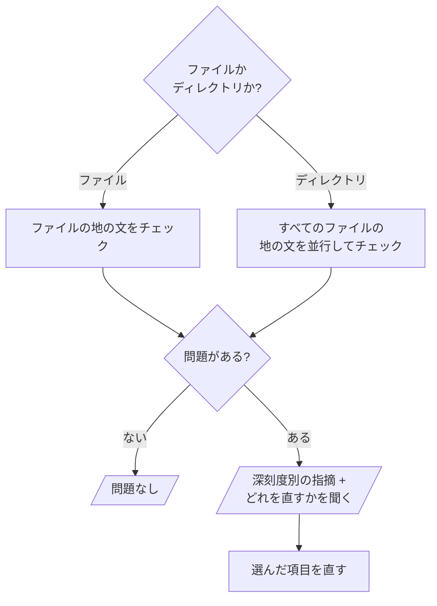

# unnatural

```mermaid
flowchart TD
  input{ファイルか<br/>ディレクトリか?}
  input -- "ファイル" --> one[ファイルの地の文をチェック]
  input -- "ディレクトリ" --> many[すべてのファイルの<br/>地の文を並行してチェック]
  one --> found
  many --> found{問題がある?}
  found -- "ない" --> none[/問題なし/]
  found -- "ある" --> report[/"深刻度別の指摘 +<br/>どれを直すかを聞く"/]
  report --> fix[選んだ項目を直す]
```
