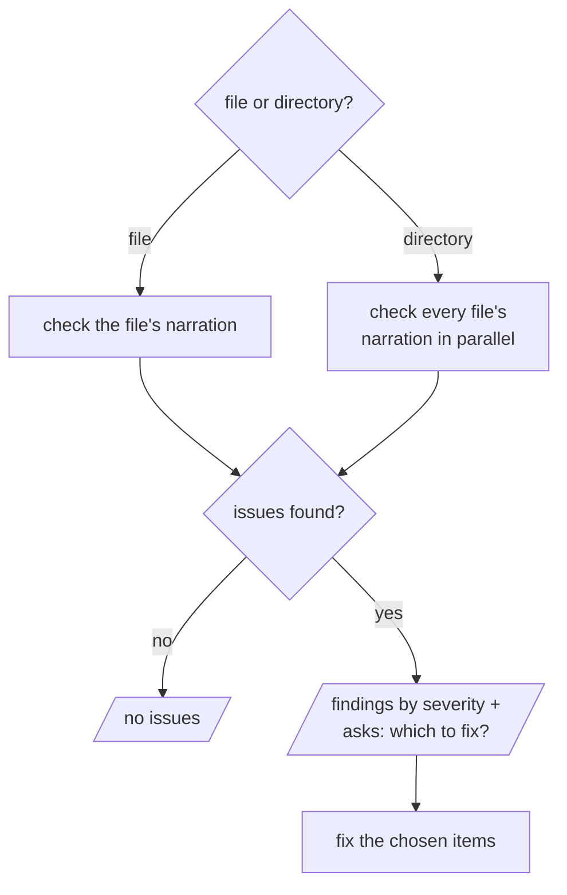

# unnatural

Checks the narration of a Japanese fiction file or directory for unnatural wording and syntax, leaving dialogue out.

Parallelograms are what the user sees and answers.

```mermaid
flowchart TD
  input{file or directory?}
  input -- "file" --> one[check the file's narration]
  input -- "directory" --> many[check every file's<br/>narration in parallel]
  one --> found
  many --> found{issues found?}
  found -- "no" --> none[/no issues/]
  found -- "yes" --> report[/"findings by severity +<br/>asks: which to fix?"/]
  report --> fix[fix the chosen items]
```
