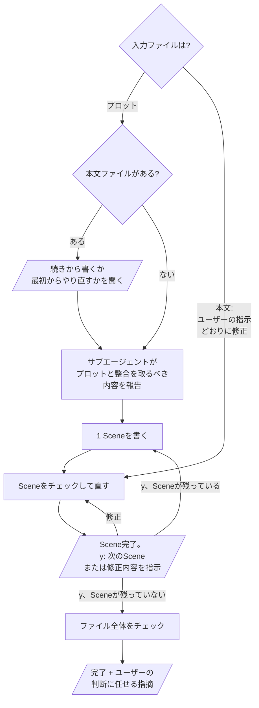

# write

プロットファイルから本文を1 Sceneずつ書く。または本文ファイルを修正する。

平行四辺形はユーザーに見えて、答えるもの。

```mermaid
flowchart TD
  input{入力ファイルは?}
  input -- "プロット" --> exists{本文ファイルがある?}
  exists -- "ある" --> ask[/続きから書くか<br/>最初からやり直すかを聞く/]
  exists -- "ない" --> agent
  ask --> agent[サブエージェントが<br/>プロットと整合を取るべき<br/>内容を報告]
  agent --> write[1 Sceneを書く]
  write --> check[Sceneをチェックして直す]
  check --> reply[/"Scene完了。<br/>y: 次のScene<br/>または修正内容を指示"/]
  reply -- "y、Sceneが残っている" --> write
  reply -- "y、Sceneが残っていない" --> final[ファイル全体をチェック]
  final --> done[/"完了 + ユーザーの<br/>判断に任せる指摘"/]
  reply -- "修正" --> check
  input -- "本文:<br/>ユーザーの指示<br/>どおりに修正" --> check
```
