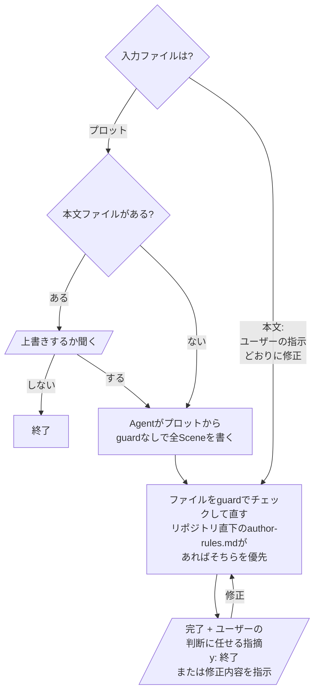

# write

```mermaid
flowchart TD
  input{入力ファイルは?}
  input -- "プロット" --> exists{本文ファイルがある?}
  exists -- "ある" --> ask[/上書きするか聞く/]
  ask -- "しない" --> stop[終了]
  ask -- "する" --> write
  exists -- "ない" --> write[Agentがプロットから<br/>guardなしで全Sceneを書く]
  write --> check[ファイルをguardでチェックして直す<br/>リポジトリ直下のauthor-rules.mdが<br/>あればそちらを優先]
  input -- "本文:<br/>ユーザーの指示<br/>どおりに修正" --> check
  check --> reply[/"完了 + ユーザーの<br/>判断に任せる指摘<br/>y: 終了<br/>または修正内容を指示"/]
  reply -- "修正" --> check
```
