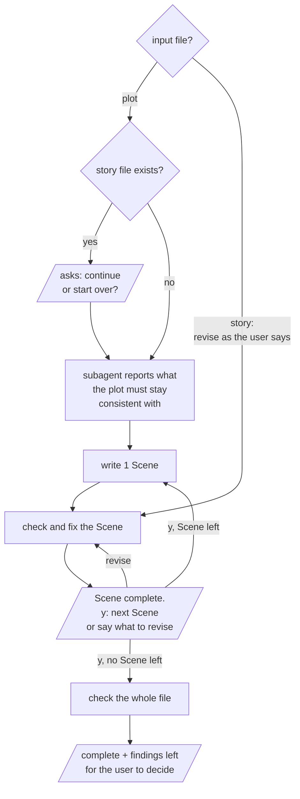

# write

Writes a story file from a plot file one Scene at a time, or revises a story file.

Parallelograms are what the user sees and answers.

```mermaid
flowchart TD
  input{input file?}
  input -- "plot" --> exists{story file exists?}
  exists -- "yes" --> ask[/asks: continue<br/>or start over?/]
  exists -- "no" --> agent
  ask --> agent[subagent reports what<br/>the plot must stay<br/>consistent with]
  agent --> write[write 1 Scene]
  write --> check[check and fix the Scene]
  check --> reply[/"Scene complete.<br/>y: next Scene<br/>or say what to revise"/]
  reply -- "y, Scene left" --> write
  reply -- "y, no Scene left" --> final[check the whole file]
  final --> done[/"complete + findings left<br/>for the user to decide"/]
  reply -- "revise" --> check
  input -- "story:<br/>revise as the user says" --> check
```
