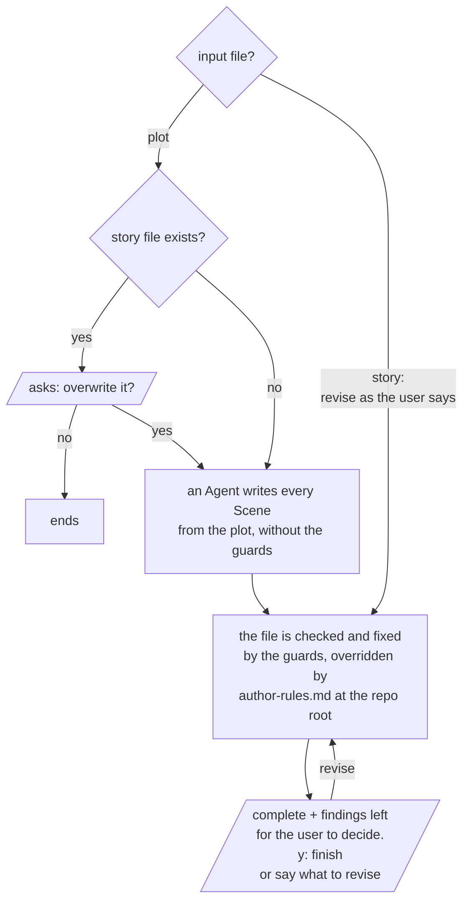

# write

```mermaid
flowchart TD
  input{input file?}
  input -- "plot" --> exists{story file exists?}
  exists -- "yes" --> ask[/asks: overwrite it?/]
  ask -- "no" --> stop[ends]
  ask -- "yes" --> write
  exists -- "no" --> write[an Agent writes every Scene<br/>from the plot, without the guards]
  write --> check[the file is checked and fixed<br/>by the guards, overridden by<br/>author-rules.md at the repo root]
  input -- "story:<br/>revise as the user says" --> check
  check --> reply[/"complete + findings left<br/>for the user to decide.<br/>y: finish<br/>or say what to revise"/]
  reply -- "revise" --> check
```
