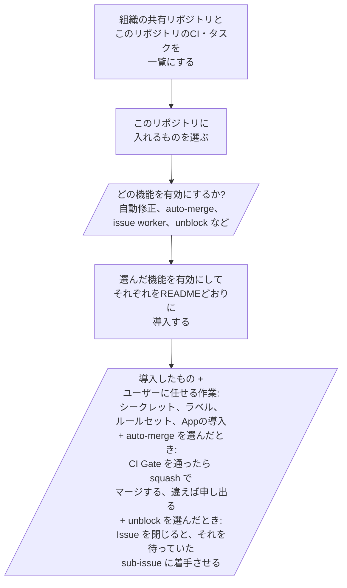

# automation

```mermaid
flowchart TD
  list[組織の共有リポジトリと<br/>このリポジトリのCI・タスクを<br/>一覧にする]
  list --> pick[このリポジトリに<br/>入れるものを選ぶ]
  pick --> ask[/"どの機能を有効にするか?<br/>自動修正、auto-merge、<br/>issue worker、unblock など"/]
  ask --> install[選んだ機能を有効にして<br/>それぞれをREADMEどおりに<br/>導入する]
  install --> done[/"導入したもの +<br/>ユーザーに任せる作業:<br/>シークレット、ラベル、<br/>ルールセット、Appの導入<br/>+ auto-merge を選んだとき:<br/>CI Gate を通ったら squash で<br/>マージする、違えば申し出る<br/>+ unblock を選んだとき:<br/>Issue を閉じると、それを待っていた<br/>sub-issue に着手させる"/]
```
