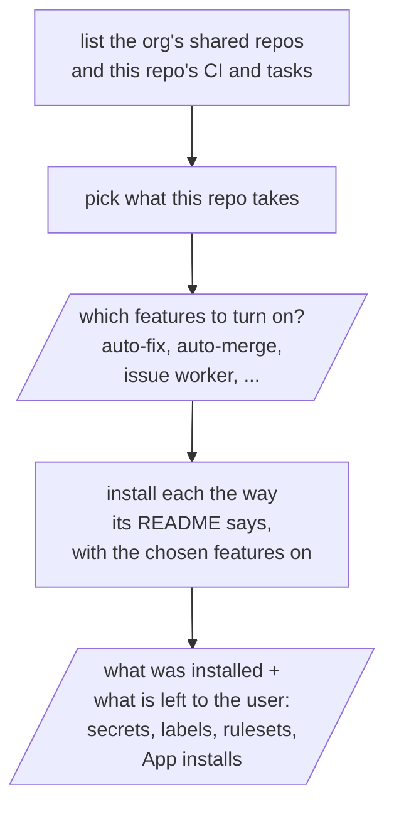

# automation

```mermaid
flowchart TD
  list[list the org's shared repos<br/>and this repo's CI and tasks]
  list --> pick[pick what this repo takes]
  pick --> ask[/"which features to turn on?<br/>auto-fix, auto-merge,<br/>issue worker, ..."/]
  ask --> install[install each the way<br/>its README says,<br/>with the chosen features on]
  install --> done[/"what was installed +<br/>what is left to the user:<br/>secrets, labels, rulesets,<br/>App installs"/]
```
