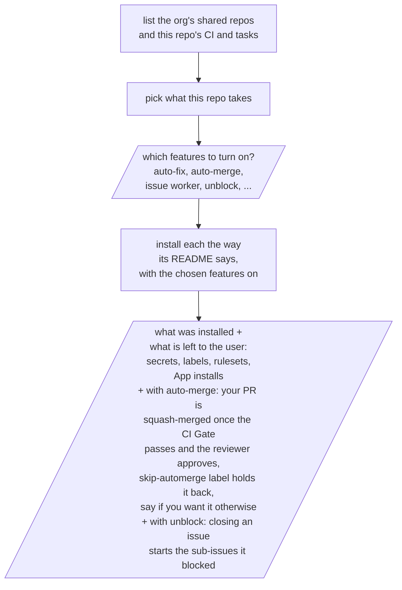

# automation

```mermaid
flowchart TD
  list[list the org's shared repos<br/>and this repo's CI and tasks]
  list --> pick[pick what this repo takes]
  pick --> ask[/"which features to turn on?<br/>auto-fix, auto-merge,<br/>issue worker, unblock, ..."/]
  ask --> install[install each the way<br/>its README says,<br/>with the chosen features on]
  install --> done[/"what was installed +<br/>what is left to the user:<br/>secrets, labels, rulesets,<br/>App installs<br/>+ with auto-merge: your PR is<br/>squash-merged once the CI Gate<br/>passes and the reviewer approves,<br/>skip-automerge label holds it back,<br/>say if you want it otherwise<br/>+ with unblock: closing an issue<br/>starts the sub-issues it blocked"/]
```
