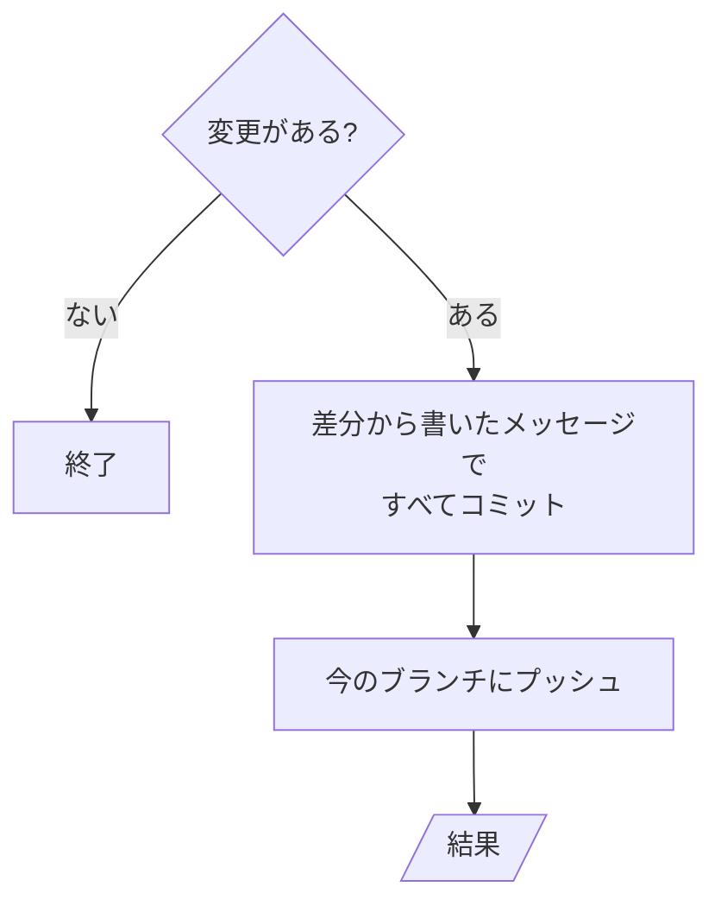

# cap

現在の変更をすべてコミットし、今のブランチにプッシュする。

平行四辺形はユーザーに見えて、答えるもの。

```mermaid
flowchart TD
  changes{変更がある?}
  changes -- "ない" --> stop[終了]
  changes -- "ある" --> commit[差分から書いたメッセージで<br/>すべてコミット]
  commit --> push[今のブランチにプッシュ]
  push --> result[/結果/]
```
