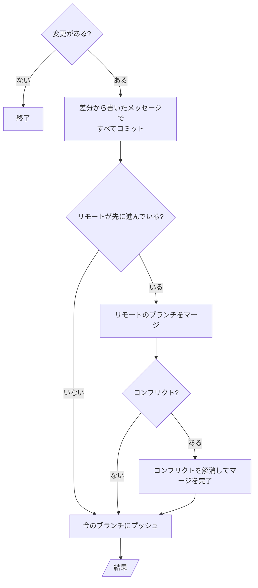

# cap

```mermaid
flowchart TD
  changes{変更がある?}
  changes -- "ない" --> stop[終了]
  changes -- "ある" --> commit[差分から書いたメッセージで<br/>すべてコミット]
  commit --> ahead{リモートが先に進んでいる?}
  ahead -- "いない" --> push[今のブランチにプッシュ]
  ahead -- "いる" --> merge[リモートのブランチをマージ]
  merge --> conflict{コンフリクト?}
  conflict -- "ない" --> push
  conflict -- "ある" --> resolve[コンフリクトを解消してマージを完了]
  resolve --> push
  push --> result[/結果/]
```
