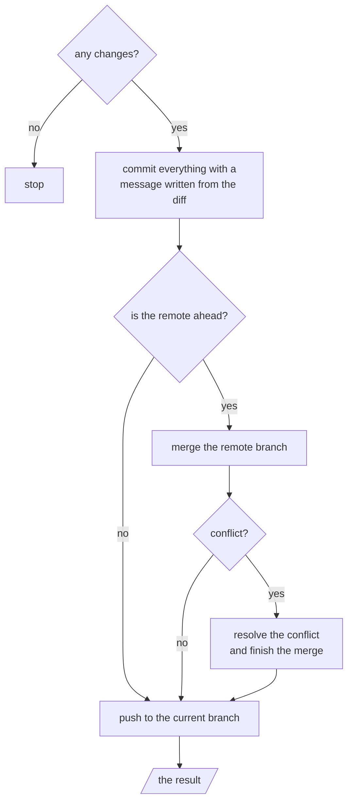

# cap

```mermaid
flowchart TD
  changes{any changes?}
  changes -- "no" --> stop[stop]
  changes -- "yes" --> commit[commit everything with a<br/>message written from the diff]
  commit --> ahead{is the remote ahead?}
  ahead -- "no" --> push[push to the current branch]
  ahead -- "yes" --> merge[merge the remote branch]
  merge --> conflict{conflict?}
  conflict -- "no" --> push
  conflict -- "yes" --> resolve[resolve the conflict<br/>and finish the merge]
  resolve --> push
  push --> result[/the result/]
```
