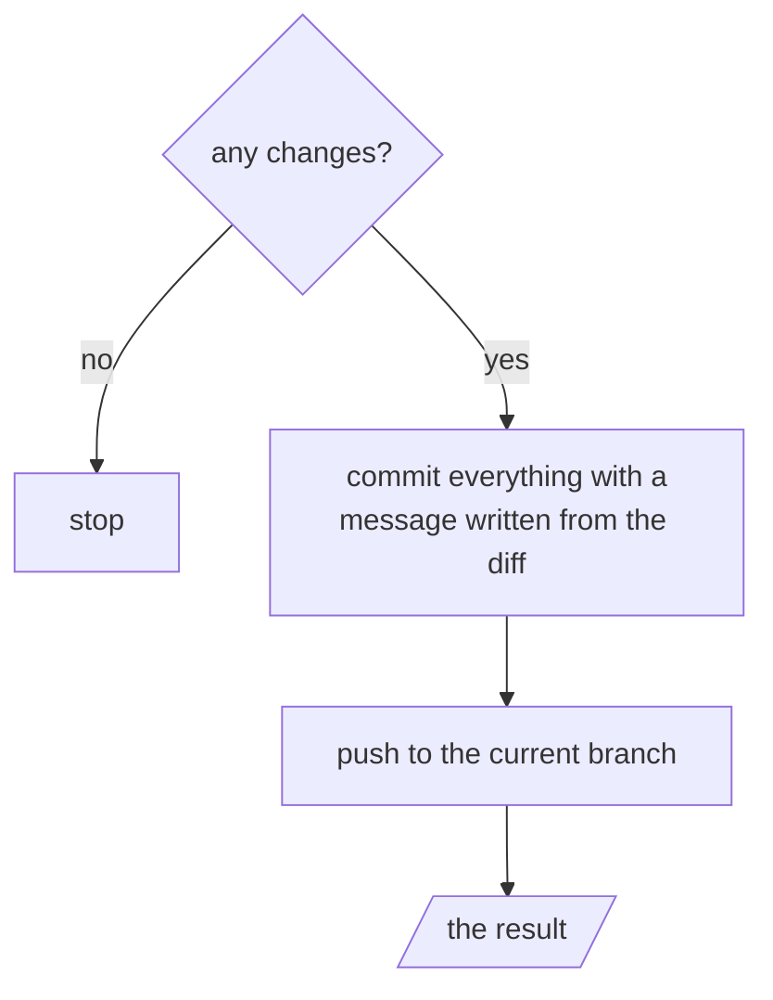

# cap

```mermaid
flowchart TD
  changes{any changes?}
  changes -- "no" --> stop[stop]
  changes -- "yes" --> commit[commit everything with a<br/>message written from the diff]
  commit --> push[push to the current branch]
  push --> result[/the result/]
```
