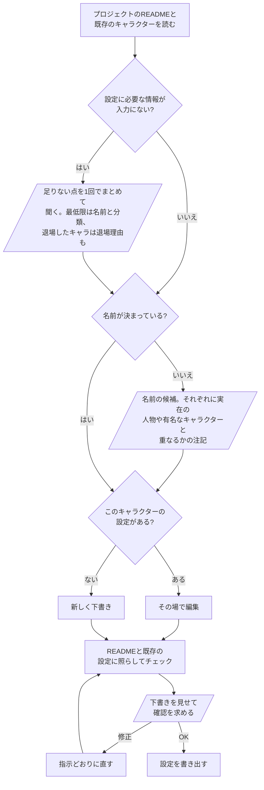

# character

対話を通してキャラクター設定を作成・編集する。

平行四辺形はユーザーに見えて、答えるもの。

```mermaid
flowchart TD
  read[プロジェクトのREADMEと<br/>既存のキャラクターを読む]
  read --> missing{設定に必要な情報が<br/>入力にない?}
  missing -- "はい" --> ask[/"足りない点を1回でまとめて<br/>聞く。最低限は名前と分類、<br/>退場したキャラは退場理由も"/]
  missing -- "いいえ" --> named
  ask --> named{名前が決まっている?}
  named -- "いいえ" --> names[/"名前の候補。それぞれに実在の<br/>人物や有名なキャラクターと<br/>重なるかの注記"/]
  names --> exists
  named -- "はい" --> exists{このキャラクターの<br/>設定がある?}
  exists -- "ある" --> edit[その場で編集]
  exists -- "ない" --> draft[新しく下書き]
  edit --> check[READMEと既存の<br/>設定に照らしてチェック]
  draft --> check
  check --> confirm[/下書きを見せて<br/>確認を求める/]
  confirm -- "修正" --> revise[指示どおりに直す]
  revise --> check
  confirm -- "OK" --> save[設定を書き出す]
```
