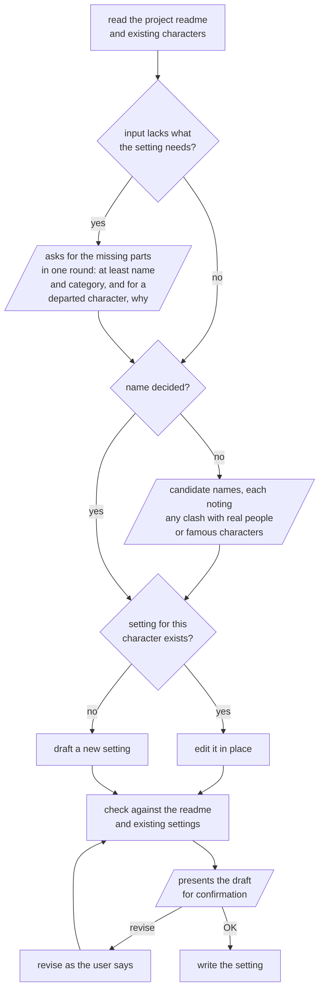

# character

Creates or edits a character setting through dialogue.

Parallelograms are what the user sees and answers.

```mermaid
flowchart TD
  read[read the project readme<br/>and existing characters]
  read --> missing{input lacks what<br/>the setting needs?}
  missing -- "yes" --> ask[/"asks for the missing parts<br/>in one round: at least name<br/>and category, and for a<br/>departed character, why"/]
  missing -- "no" --> named
  ask --> named{name decided?}
  named -- "no" --> names[/"candidate names, each noting<br/>any clash with real people<br/>or famous characters"/]
  names --> exists
  named -- "yes" --> exists{setting for this<br/>character exists?}
  exists -- "yes" --> edit[edit it in place]
  exists -- "no" --> draft[draft a new setting]
  edit --> check[check against the readme<br/>and existing settings]
  draft --> check
  check --> confirm[/presents the draft<br/>for confirmation/]
  confirm -- "revise" --> revise[revise as the user says]
  revise --> check
  confirm -- "OK" --> save[write the setting]
```
