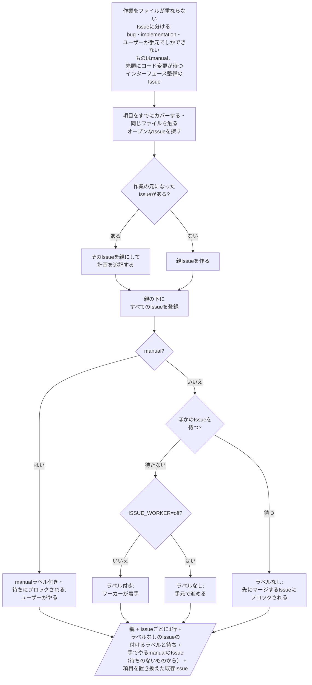

# delegate

```mermaid
flowchart TD
  split["作業をファイルが重ならない<br/>Issueに分ける:<br/>bug・implementation・<br/>ユーザーが手元でしかできない<br/>ものはmanual、<br/>先頭にコード変更が待つ<br/>インターフェース整備のIssue"]
  split --> similar[項目をすでにカバーする・<br/>同じファイルを触る<br/>オープンなIssueを探す]
  similar --> origin{作業の元になった<br/>Issueがある?}
  origin -- "ある" --> comment[そのIssueを親にして<br/>計画を追記する]
  origin -- "ない" --> parent[親Issueを作る]
  comment --> create[親の下に<br/>すべてのIssueを登録]
  create --> kind{manual?}
  kind -- "はい" --> manual[manualラベル付き・<br/>待ちにブロックされる:<br/>ユーザーがやる]
  kind -- "いいえ" --> wait{ほかのIssueを<br/>待つ?}
  wait -- "待たない" --> off{ISSUE_WORKER=off?}
  off -- "いいえ" --> now[ラベル付き:<br/>ワーカーが着手]
  off -- "はい" --> local[ラベルなし:<br/>手元で進める]
  wait -- "待つ" --> later[ラベルなし:<br/>先にマージするIssueに<br/>ブロックされる]
  parent --> create
  now --> report[/"親 + Issueごとに1行 +<br/>ラベルなしのIssueの<br/>付けるラベルと待ち +<br/>手でやるmanualのIssue<br/>（待ちのないものから） +<br/>項目を置き換えた既存Issue"/]
  later --> report
  local --> report
  manual --> report
```
