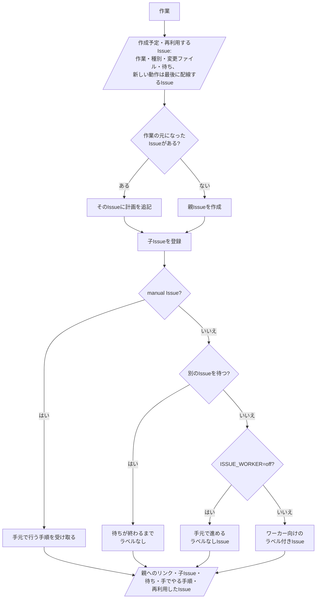

# delegate

```mermaid
flowchart TD
  task[作業] --> preview[/作成予定・再利用するIssue:<br/>作業・種別・変更ファイル・待ち、<br/>新しい動作は最後に配線するIssue/]
  preview --> origin{作業の元になった<br/>Issueがある?}
  origin -- "ある" --> existing[そのIssueに計画を追記]
  origin -- "ない" --> parent[親Issueを作成]
  existing --> issues[子Issueを登録]
  parent --> issues
  issues --> kind{manual Issue?}
  kind -- "はい" --> manual[手元で行う手順を受け取る]
  kind -- "いいえ" --> wait{別のIssueを待つ?}
  wait -- "はい" --> later[待ちが終わるまで<br/>ラベルなし]
  wait -- "いいえ" --> worker{ISSUE_WORKER=off?}
  worker -- "はい" --> local[手元で進める<br/>ラベルなしIssue]
  worker -- "いいえ" --> now[ワーカー向けの<br/>ラベル付きIssue]
  manual --> report[/親へのリンク・子Issue・<br/>待ち・手でやる手順・<br/>再利用したIssue/]
  later --> report
  local --> report
  now --> report
```
