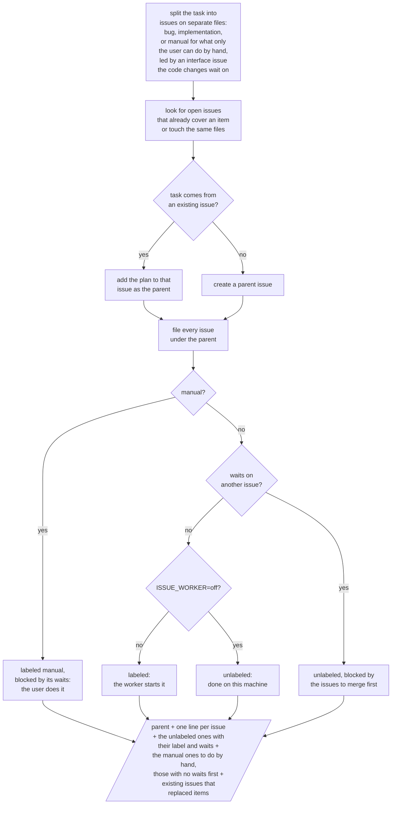

# delegate

```mermaid
flowchart TD
  split["split the task into<br/>issues on separate files:<br/>bug, implementation,<br/>or manual for what only<br/>the user can do by hand,<br/>led by an interface issue<br/>the code changes wait on"]
  split --> similar[look for open issues<br/>that already cover an item<br/>or touch the same files]
  similar --> origin{task comes from<br/>an existing issue?}
  origin -- "yes" --> comment[add the plan to that<br/>issue as the parent]
  origin -- "no" --> parent[create a parent issue]
  comment --> create[file every issue<br/>under the parent]
  create --> kind{manual?}
  kind -- "yes" --> manual[labeled manual,<br/>blocked by its waits:<br/>the user does it]
  kind -- "no" --> wait{waits on<br/>another issue?}
  wait -- "no" --> off{ISSUE_WORKER=off?}
  off -- "no" --> now[labeled:<br/>the worker starts it]
  off -- "yes" --> local[unlabeled:<br/>done on this machine]
  wait -- "yes" --> later[unlabeled, blocked by<br/>the issues to merge first]
  parent --> create
  now --> report[/"parent + one line per issue<br/>+ the unlabeled ones with<br/>their label and waits +<br/>the manual ones to do by hand,<br/>those with no waits first +<br/>existing issues that<br/>replaced items"/]
  later --> report
  local --> report
  manual --> report
```
