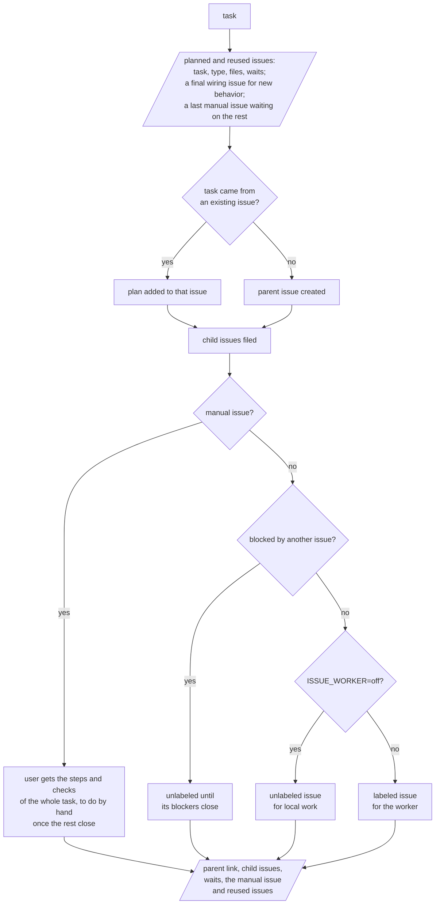

# delegate

```mermaid
flowchart TD
  task[task] --> preview[/planned and reused issues:<br/>task, type, files, waits;<br/>a final wiring issue for new behavior;<br/>a last manual issue waiting on the rest/]
  preview --> origin{task came from<br/>an existing issue?}
  origin -- "yes" --> existing[plan added to that issue]
  origin -- "no" --> parent[parent issue created]
  existing --> issues[child issues filed]
  parent --> issues
  issues --> kind{manual issue?}
  kind -- "yes" --> manual[user gets the steps and checks<br/>of the whole task, to do by hand<br/>once the rest close]
  kind -- "no" --> wait{blocked by another issue?}
  wait -- "yes" --> later[unlabeled until<br/>its blockers close]
  wait -- "no" --> worker{ISSUE_WORKER=off?}
  worker -- "yes" --> local[unlabeled issue<br/>for local work]
  worker -- "no" --> now[labeled issue<br/>for the worker]
  manual --> report[/parent link, child issues,<br/>waits, the manual issue<br/>and reused issues/]
  later --> report
  local --> report
  now --> report
```
