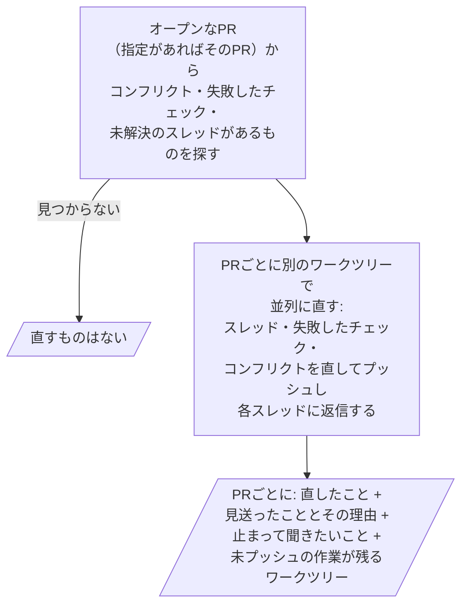

# fix-prs

```mermaid
flowchart TD
  scan[オープンなPR<br/>（指定があればそのPR）から<br/>コンフリクト・失敗したチェック・<br/>未解決のスレッドがあるものを探す]
  scan -- "見つからない" --> none[/直すものはない/]
  scan --> fix[PRごとに別のワークツリーで<br/>並列に直す:<br/>スレッド・失敗したチェック・<br/>コンフリクトを直してプッシュし<br/>各スレッドに返信する]
  fix --> report[/"PRごとに: 直したこと +<br/>見送ったこととその理由 +<br/>止まって聞きたいこと +<br/>未プッシュの作業が残る<br/>ワークツリー"/]
```
