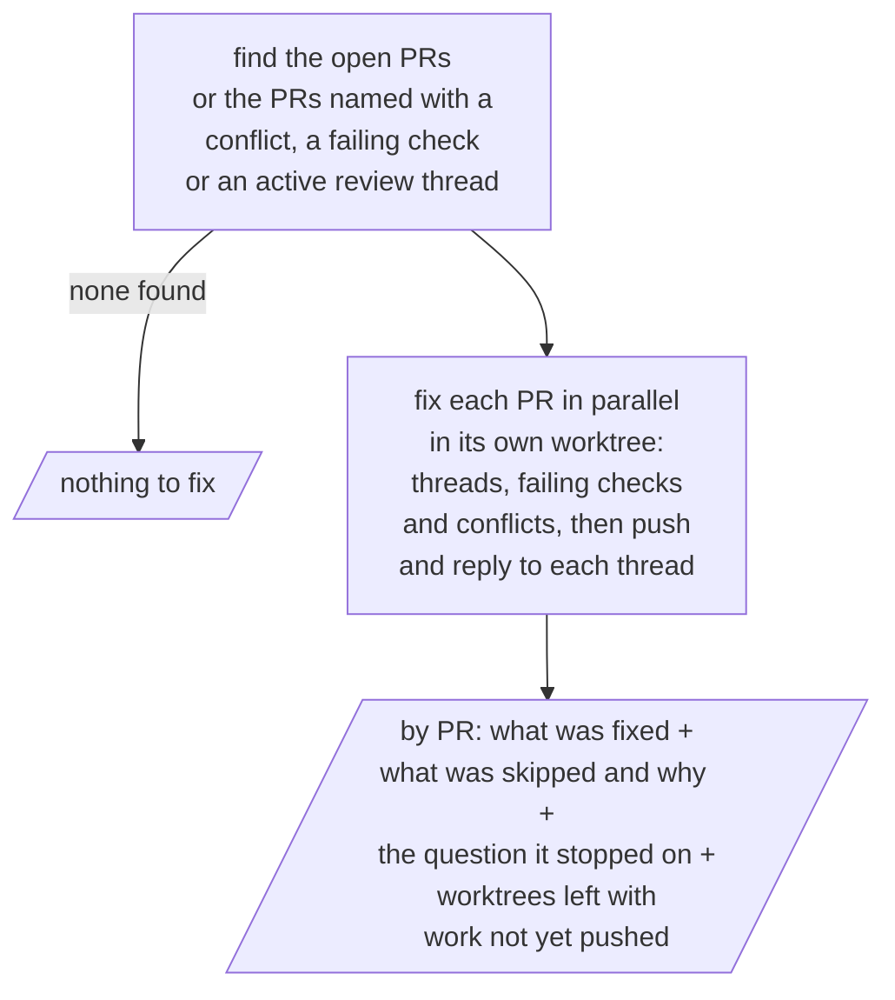

# fix-prs

```mermaid
flowchart TD
  scan[find the open PRs<br/>or the PRs named with a<br/>conflict, a failing check<br/>or an active review thread]
  scan -- "none found" --> none[/nothing to fix/]
  scan --> fix[fix each PR in parallel<br/>in its own worktree:<br/>threads, failing checks<br/>and conflicts, then push<br/>and reply to each thread]
  fix --> report[/"by PR: what was fixed +<br/>what was skipped and why +<br/>the question it stopped on +<br/>worktrees left with<br/>work not yet pushed"/]
```
