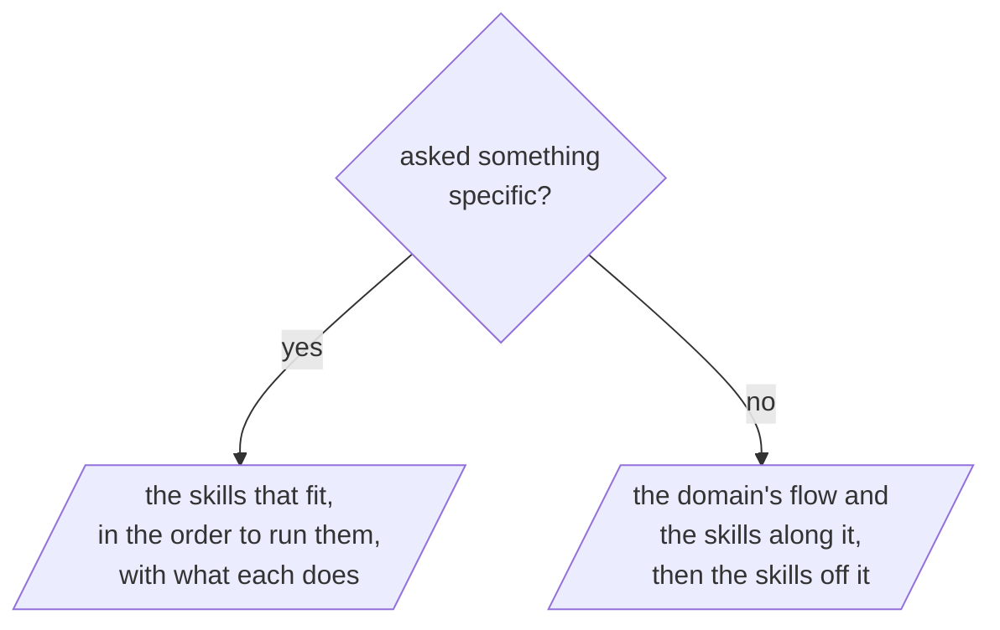

# guide

```mermaid
flowchart TD
  ask{asked something<br/>specific?}
  ask -- "yes" --> fit[/"the skills that fit,<br/>in the order to run them,<br/>with what each does"/]
  ask -- "no" --> walk[/"the domain's flow and<br/>the skills along it,<br/>then the skills off it"/]
```
