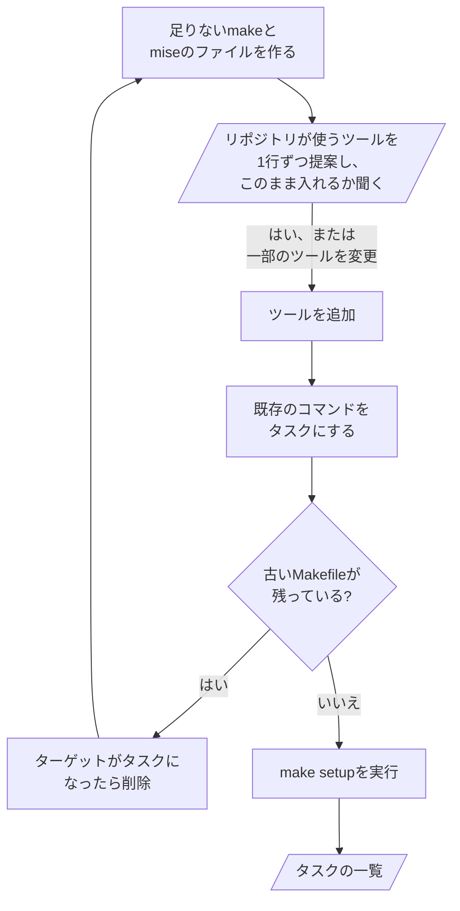

# init

リポジトリをmiseとmakeに載せ、すべてのコマンドを `make <name>` で動くようにする。

平行四辺形はユーザーに見えて、答えるもの。

```mermaid
flowchart TD
  create[足りないmakeと<br/>miseのファイルを作る]
  create --> tools[/"リポジトリが使うツールを<br/>1行ずつ提案し、<br/>このまま入れるか聞く"/]
  tools -- "はい、または<br/>一部のツールを変更" --> write[ツールを追加]
  write --> tasks[既存のコマンドを<br/>タスクにする]
  tasks --> old{古いMakefileが<br/>残っている?}
  old -- "はい" --> remove[ターゲットがタスクに<br/>なったら削除]
  remove --> create
  old -- "いいえ" --> setup[make setupを実行]
  setup --> list[/タスクの一覧/]
```
