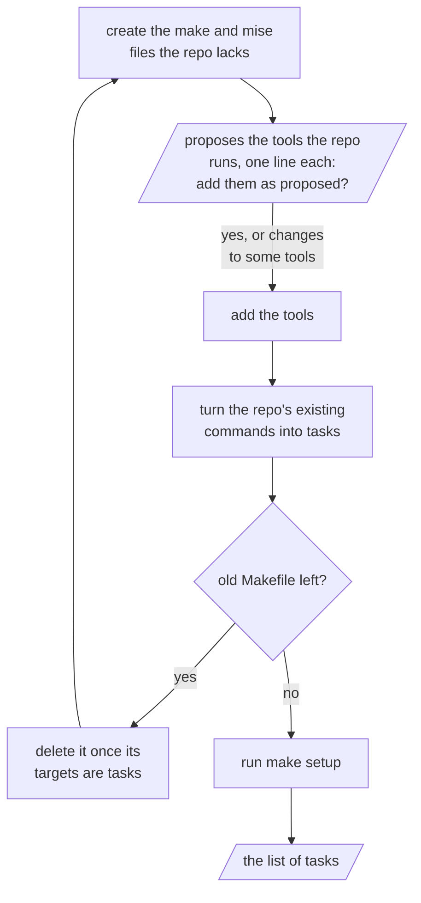

# init

Puts the repo on mise and make, so every command runs as `make <name>`.

Parallelograms are what the user sees and answers.

```mermaid
flowchart TD
  create[create the make and mise<br/>files the repo lacks]
  create --> tools[/"proposes the tools the repo<br/>runs, one line each:<br/>add them as proposed?"/]
  tools -- "yes, or changes<br/>to some tools" --> write[add the tools]
  write --> tasks[turn the repo's existing<br/>commands into tasks]
  tasks --> old{old Makefile left?}
  old -- "yes" --> remove[delete it once its<br/>targets are tasks]
  remove --> create
  old -- "no" --> setup[run make setup]
  setup --> list[/the list of tasks/]
```
