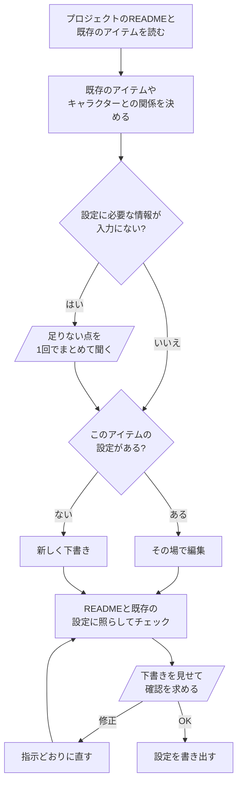

# item

対話を通してアイテム設定を作成・編集する。

平行四辺形はユーザーに見えて、答えるもの。

```mermaid
flowchart TD
  read[プロジェクトのREADMEと<br/>既存のアイテムを読む]
  read --> relate[既存のアイテムや<br/>キャラクターとの関係を決める]
  relate --> missing{設定に必要な情報が<br/>入力にない?}
  missing -- "はい" --> ask[/足りない点を<br/>1回でまとめて聞く/]
  missing -- "いいえ" --> exists
  ask --> exists{このアイテムの<br/>設定がある?}
  exists -- "ある" --> edit[その場で編集]
  exists -- "ない" --> draft[新しく下書き]
  edit --> check[READMEと既存の<br/>設定に照らしてチェック]
  draft --> check
  check --> confirm[/下書きを見せて<br/>確認を求める/]
  confirm -- "修正" --> revise[指示どおりに直す]
  revise --> check
  confirm -- "OK" --> save[設定を書き出す]
```
