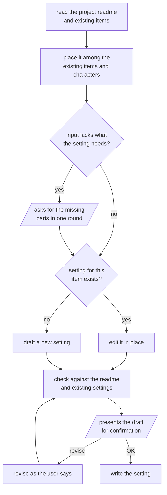

# item

Creates or edits an item setting through dialogue.

Parallelograms are what the user sees and answers.

```mermaid
flowchart TD
  read[read the project readme<br/>and existing items]
  read --> relate[place it among the<br/>existing items and characters]
  relate --> missing{input lacks what<br/>the setting needs?}
  missing -- "yes" --> ask[/asks for the missing<br/>parts in one round/]
  missing -- "no" --> exists
  ask --> exists{setting for this<br/>item exists?}
  exists -- "yes" --> edit[edit it in place]
  exists -- "no" --> draft[draft a new setting]
  edit --> check[check against the readme<br/>and existing settings]
  draft --> check
  check --> confirm[/presents the draft<br/>for confirmation/]
  confirm -- "revise" --> revise[revise as the user says]
  revise --> check
  confirm -- "OK" --> save[write the setting]
```
