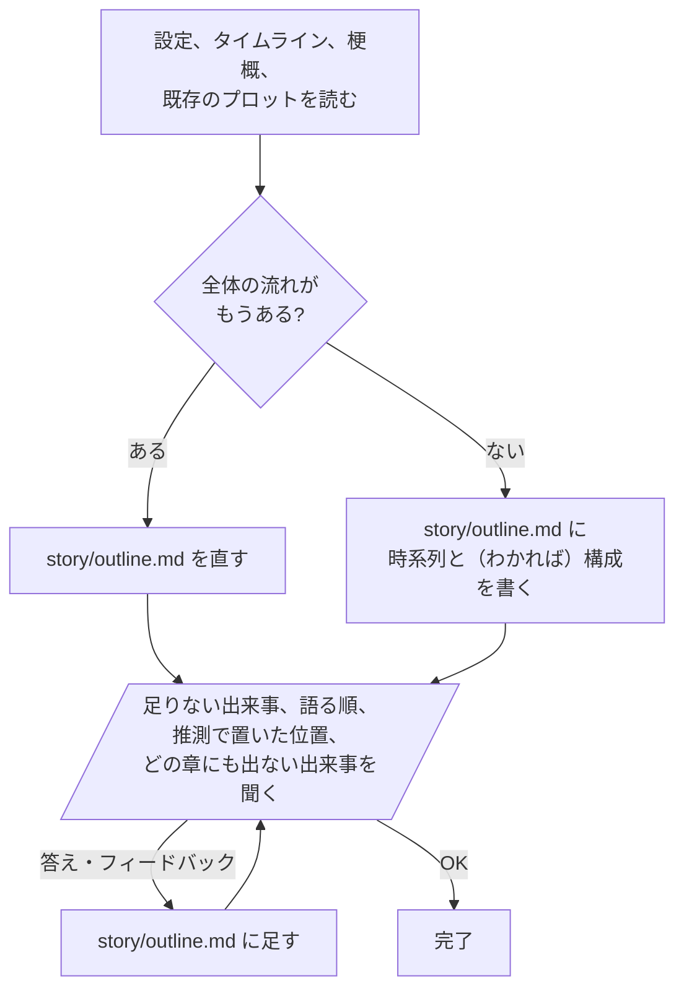

# outline

```mermaid
flowchart TD
  read[設定、タイムライン、梗概、<br/>既存のプロットを読む]
  read --> exists{全体の流れが<br/>もうある?}
  exists -- "ある" --> revise[story/outline.md を直す]
  exists -- "ない" --> draft[story/outline.md に<br/>時系列と（わかれば）構成を書く]
  revise --> ask
  draft --> ask[/"足りない出来事、語る順、<br/>推測で置いた位置、<br/>どの章にも出ない出来事を聞く"/]
  ask -- "答え・フィードバック" --> fix[story/outline.md に足す]
  fix --> ask
  ask -- "OK" --> done[完了]
```
