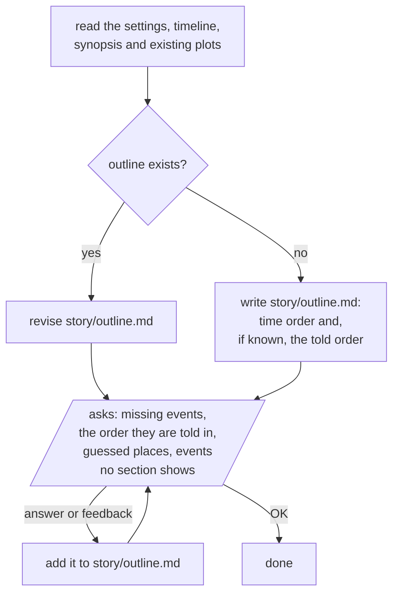

# outline

```mermaid
flowchart TD
  read[read the settings, timeline,<br/>synopsis and existing plots]
  read --> exists{outline exists?}
  exists -- "yes" --> revise[revise story/outline.md]
  exists -- "no" --> draft[write story/outline.md:<br/>time order and,<br/>if known, the told order]
  revise --> ask
  draft --> ask[/"asks: missing events,<br/>the order they are told in,<br/>guessed places, events<br/>no section shows"/]
  ask -- "answer or feedback" --> fix[add it to story/outline.md]
  fix --> ask
  ask -- "OK" --> done[done]
```
