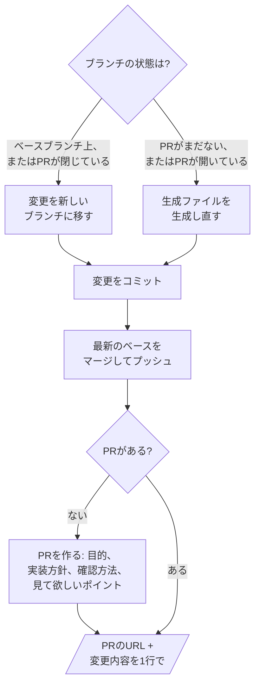

# pr

現在のブランチからプルリクエストを作る。すでにあればそれを更新する。

平行四辺形はユーザーに見えて、答えるもの。

```mermaid
flowchart TD
  state{ブランチの状態は?}
  state -- "ベースブランチ上、<br/>またはPRが閉じている" --> branch[変更を新しい<br/>ブランチに移す]
  state -- "PRがまだない、<br/>またはPRが開いている" --> regen[生成ファイルを<br/>生成し直す]
  branch --> commit
  regen --> commit[変更をコミット]
  commit --> push[最新のベースを<br/>マージしてプッシュ]
  push --> pr{PRがある?}
  pr -- "ない" --> open["PRを作る: 目的、<br/>実装方針、確認方法、<br/>見て欲しいポイント"]
  open --> url[/"PRのURL +<br/>変更内容を1行で"/]
  pr -- "ある" --> url
```
