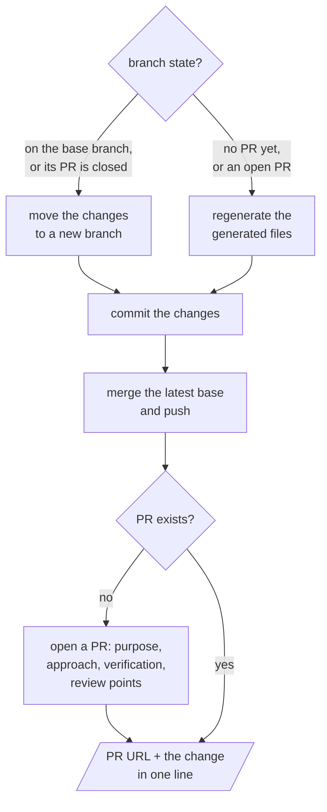

# pr

Opens a pull request from the current branch, or updates the one it already has.

Parallelograms are what the user sees and answers.

```mermaid
flowchart TD
  state{branch state?}
  state -- "on the base branch,<br/>or its PR is closed" --> branch[move the changes<br/>to a new branch]
  state -- "no PR yet,<br/>or an open PR" --> regen[regenerate the<br/>generated files]
  branch --> commit
  regen --> commit[commit the changes]
  commit --> push[merge the latest base<br/>and push]
  push --> pr{PR exists?}
  pr -- "no" --> open["open a PR: purpose,<br/>approach, verification,<br/>review points"]
  open --> url[/"PR URL + the change<br/>in one line"/]
  pr -- "yes" --> url
```
