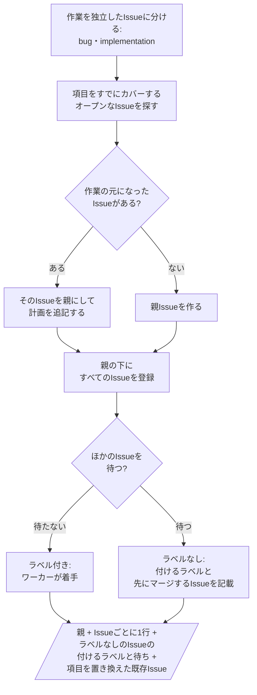

# remote-issue

```mermaid
flowchart TD
  split["作業を独立したIssueに分ける:<br/>bug・implementation"]
  split --> similar[項目をすでにカバーする<br/>オープンなIssueを探す]
  similar --> origin{作業の元になった<br/>Issueがある?}
  origin -- "ある" --> comment[そのIssueを親にして<br/>計画を追記する]
  origin -- "ない" --> parent[親Issueを作る]
  comment --> create[親の下に<br/>すべてのIssueを登録]
  create --> wait{ほかのIssueを<br/>待つ?}
  wait -- "待たない" --> now[ラベル付き:<br/>ワーカーが着手]
  wait -- "待つ" --> later[ラベルなし:<br/>付けるラベルと<br/>先にマージするIssueを記載]
  parent --> create
  now --> report[/"親 + Issueごとに1行 +<br/>ラベルなしのIssueの<br/>付けるラベルと待ち +<br/>項目を置き換えた既存Issue"/]
  later --> report
```
